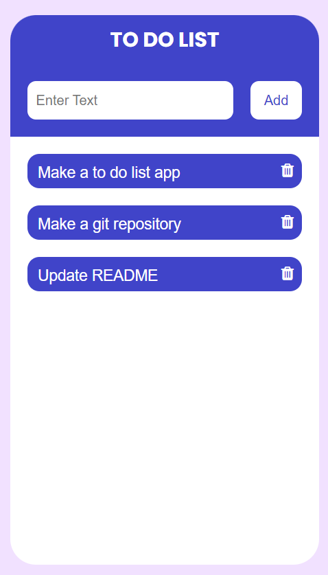

# 📒 To-Do List App

This is a simple app that lets you: 

* add
* edit 
* delete 

items on your to do list. 

👩‍💻 As a beginner in ReactJS, this project improved my knowledge and application.

### 💻 Deployed At:
#### https://todolist-anushkachauhan.surge.sh

### ⏳ Future Plans:

I hope to add **more features** in the future.

Like: 
* ability to rearrange items by dragging them
* changing colours of different items
* labelling them according to type of task
* finding items in their respective 'label' folders

